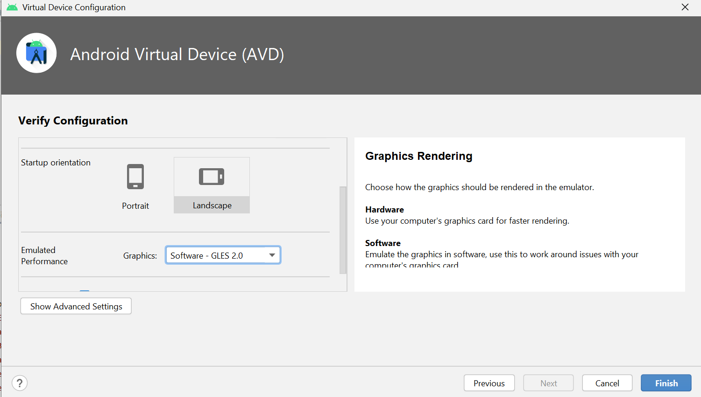

# battleships<br/>

## Install project <br/>
Clone gitLab repo with SSH/HTTP key. <br/>
The project is andorid speciefied so you need two android emulators to run the multiplayer game. <br/>

## Run emulators <br/>
We reccomend to set up this virtual device: <br/>
```bash
pip install foobar
Name: Pixel 3a 
Size: 5,6 
Resolution: 1080x2220 
Density: 440dpi 
Settings: 
```
 <br/>


You can set up two of these devices on your computer, or have one on the computer and run the game simontaniously on your android phone. The app runs faster on your phone, so we reccomend this if you have an android phone. <br/>

<br/> To play multiplayer and see the highscore list, you have be online, having internet.

You should have the latest Android Emulator version to make your emulator run faster, we reccommend version 30.5.4 <br/>


